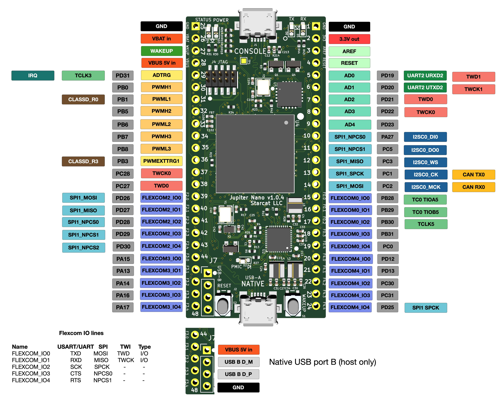
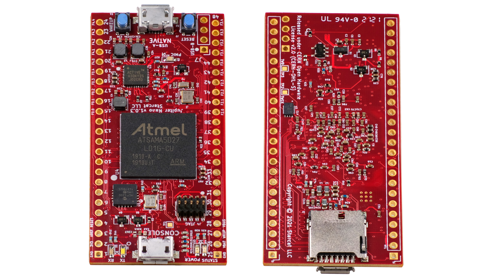

# Jupiter Nano

This repository contains the KiCAD hardware design files for the Jupiter Nano.

This is a small Open Source Hardware board based on the [Microchip
SAMA5D27C-LD1G](https://www.microchip.com/en-us/product/ATSAMA5D27) microprocessor. It runs Linux and the [Apache NuttX
Real Time Operating System (RTOS)](https://nuttx.apache.org/).

It's available from [Crowd Supply](https://www.crowdsupply.com/) at the [Jupiter Nano project
page](https://www.crowdsupply.com/starcat/jupiter-nano).

More information can be found at the [Starcat Jupiter Nano product page](https://www.starcat.io/products/jupiter-nano/).
Software tools are available at the [Jupiter Nano software tools repository on
Github](https://github.com/starcat-io/jupiter-nano-tools).

## Status

This board is in production and works. 

## License

[CERN-OHL-S](https://ohwr.org/cern_ohl_w_v2.txt) (Strongly Reciprocal). For more information, see the LICENSE file in
this repository, or the [CERN Open Hardware License v2.0](https://ohwr.org/cernohl) page.

## Features & Specifications

- **Runs NuttX RTOS or Linux:** [U-Boot open-source boot loader](https://www.denx.de/wiki/U-Boot) works for Linux and NuttX (or Linux can be booted directly)
- **Size:**
  - 48-pin form factor
  - 2.86 cm x 6.35 cm (1.125" x 2.5")
  - Similar in size to Teensy 4.1
- **Programming:** JTAG port for programming and debugging
- **CPU:** [Microchip SAMA5D27C-LD1G](https://www.qorvo.com/products/p/ACT8945A) running at 498 MHz
- **DRAM:** AP Memory AD2100XXX 128 M x 32 LPDDR2 DRAM chip integrated into system-in-package (SIP)
- **Power management:** [Qorvo ACT8945A](https://www.qorvo.com/products/p/ACT8945A) with integrated LiPo battery charging capability
- **Power delivery:** Compatible with many LiPo batteries
- **Open Hardware:** Design can be altered using 100% open source KiCAD software
- **10x more powerful than the Arduino Due:**
  - ARM Cortex A5 processor running at 498 MHz (7x the clock speed of an Arduino Due)
  - 128 MB RAM (1280x the RAM of an Arduino Due)
  - Key peripherals (USB, SPI, I²C, Flexcom) support DMA
- **I/O:**
  - USB 2.0 High-Speed port on USB Micro B connector (Port A, 480 Mbps, host or device)
  - USB 2.0 High-Speed port on a pin-header connection (Port B, 480 Mbps, host only)
  - USB 2.0 Full-Speed debug console port on USB Micro B connector (12 Mbps)
  - Micro SD Card slot (50 MHz DDR) supports booting from removable storage, making it impossible to brick the device
  - Native SPI, TWI, CAN, and I²SC ports
  - 4 FLEXCOMs on I/O pins – flexible serial controller peripherals that can be SPI, USART, or TWI

## Pinout

## Picture

## Board layout

## Contact

Adam Feuer  
adam@starcat.io  
[Starcat LLC](https://starcat.io)  
Seattle, WA, USA  

